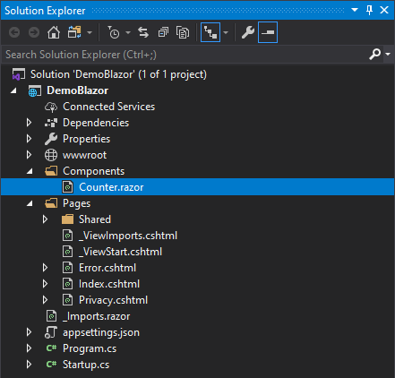

# WebApplicationBlazor
Использование Blazor компонентов в Razor Pages Web SIte

## Short guide
1. Create an ASP.NET Core Razor pages application

```bash
dotnet new "ASP.NET Core Web App"
```

2. Add an `_Imports.razor` file to the root folder of the project with the following content
```cshtml
@using System.Net.Http
@using Microsoft.AspNetCore.Authorization
@using Microsoft.AspNetCore.Components.Authorization
@using Microsoft.AspNetCore.Components.Forms
@using Microsoft.AspNetCore.Components.Routing
@using Microsoft.AspNetCore.Components.Web
@using Microsoft.JSInterop
@* 👇 Change this namespace to match your application namespace *@
@using WebApplicationBlazor
```

3. Create the Blazor Component. Add a file named `Components/Counter.razor` and set the following content:
```cshtml
<p>Current count: @currentCount</p>
<button class="btn btn-primary" @onclick="IncrementCount">Click me</button>

@code {
    private int currentCount = 0;

    [Parameter]
    public int InitialValue { get; set; }

    private void IncrementCount() => currentCount++;

    protected override void OnParametersSet()
    {
        currentCount = InitialValue;
    }
}
```

4. Change the `Startup.cs` file to add Blazor services `services.AddServerSideBlazor()` and map the required endpoints `endpoints.MapBlazorHub()`:
```csharp
public class Startup
{
    public void ConfigureServices(IServiceCollection services)
    {
        services.AddRazorPages();

        // 👇 Add this line
        services.AddServerSideBlazor();
    }

    public void Configure(IApplicationBuilder app, IWebHostEnvironment env)
    {
        if (env.IsDevelopment())
        {
            app.UseDeveloperExceptionPage();
        }
        else
        {
            app.UseExceptionHandler("/Error");
            app.UseHsts();
        }

        app.UseHttpsRedirection();
        app.UseStaticFiles();
        app.UseRouting();
        app.UseAuthorization();
        app.UseEndpoints(endpoints =>
        {
            endpoints.MapRazorPages();

            // 👇 Add this line
            endpoints.MapBlazorHub();
        });
    }
}
```
5. Integrate the Blazor component into a razor page, such as `Index.razor`, using the `component` tag helper, and add the Blazor server script. You can add the script using the `Scripts` section if the section is defined in the `_Layout.razor` file or you can include the `script` tag directly in the `_Layout.razor` or the current page.
```cshtml
@page

<component type="typeof(DemoBlazor.Components.Counter)" param-InitialValue="0" render-mode="Server" />

@section Scripts {
    <script src="_framework/blazor.server.js"></script>
}
```
6. Run the application
```bash
dotnet run
```

## blazor.server.js file not found
### Solution 1:
Finally figured it out, I had to add `<base href="~/" />` in the head section of the `_Layout.cshtml`.